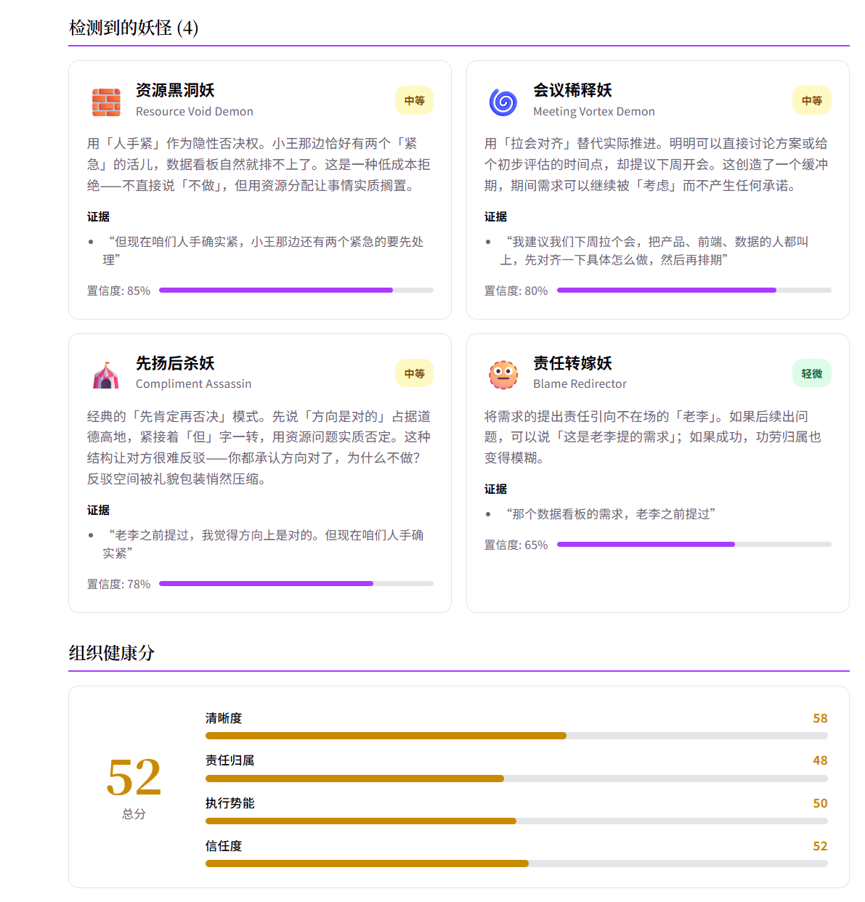

<div align="center">

# ZhaoYaoJing — OrgMirror

### Strip the bullshit. See the real org.

[](LICENSE)
[](https://www.python.org)
[](https://fastapi.tiangolo.com)
[](https://react.dev)

**English** | **[中文](README.md)**

</div>

---

## What is ZhaoYaoJing?

An open-source AI framework that strips away organizational bullshit, detects collaboration dysfunction patterns, and makes it structurally harder for people to hide behind vague language, fake consensus, and accountability drift.

Not a project management tool. Not a Jira replacement. It's an **X-ray machine for organizational dysfunction**.

> **Satire drives adoption. Diagnosis drives retention. Recommendations drive value.**

---

## Demo



<details>
<summary><b>Full example: What the mirror reveals</b></summary>

**Input:**
> "The data dashboard requirement was brought up by Lao Li before. I think the direction is right. But we're really short-staffed right now, Xiao Wang has two urgent things to handle first. I suggest we schedule a meeting next week, get product, frontend, and data people together, align on the specifics, then schedule it."

**Mirror Translation:**

| Original | Mirror |
|----------|--------|
| "I think the direction is right" | Verbal support. I won't do anything about it. |
| "We're short-staffed" | Resource veto activated. Using "tight resources" as a hidden veto. |
| "Let's schedule a meeting next week" | Meeting vortex initiated. Process replaces progress. |
| "Lao Li brought it up" | Not my idea. If it fails, not my problem. |

**Monsters Detected:**
- 👻 **Phantom Ally** (Lv.2) — Verbal support with zero follow-up
- 🧱 **Resource Void** (Lv.2) — Using resources as implicit veto power
- 🌀 **Meeting Vortex** (Lv.2) — "Let's align" replaces actual decisions
- 🫥 **Blame Redirector** (Lv.1) — Citing absent person to deflect ownership

**Health Score: 34/100** (Clarity 35 | Accountability 25 | Momentum 32 | Trust 42)

**Recommendations:**
1. [HIGH] Ask directly: "Who will own this? Give me a name."
2. [HIGH] Quantify the gap: "How many people? When can they start?"
3. [HIGH] Demand pre-meeting output: Before agreeing to "meet next week," require a draft proposal first.

</details>

---

## How It Works

Paste any organizational communication (chat logs, meeting notes, emails) and get:

| Output | What it does |
|--------|-------------|
| 🪞 **Mirror Translation** | Reveals what corporate speak actually means |
| 👻 **Monster Detection** | Identifies dysfunction patterns from the Monster Codex (17 named patterns) |
| 📊 **Health Score** | 4-dimension assessment: Clarity, Accountability, Momentum, Trust |
| 💡 **Recommendations** | Serious, actionable suggestions (not sarcastic) |
| ⚖️ **Deliberation** | Multi-party conflict resolution with AI advocates |

---

## Monster Codex (17 Built-in Patterns)

<details>
<summary><b>Communication Layer (6)</b></summary>

| Monster | What it does |
|---------|-------------|
| 🦊 **Eternal Evaluator** | Uses "evaluate" / "let's see" to avoid yes/no |
| 👻 **Phantom Ally** | Verbally supports, follows up with zero action |
| 🎭 **Ghost Mandate** | Claims untraceable upper-level authorization |
| 🎪 **Compliment Assassin** | Affirms then negates, making rebuttal impossible |
| 🏔️ **Big Picture Bully** | Uses "strategy" to suppress concrete needs |
| 🐌 **Gentle Vetoist** | "Let me think about it" = quiet no |

</details>

<details>
<summary><b>Behavior Layer (6)</b></summary>

| Monster | What it does |
|---------|-------------|
| 💨 **Diffusion Ghost** | No single owner, responsibility diluted |
| 🧱 **Resource Void** | Verbal resource commitment, never delivers |
| 🌀 **Meeting Vortex** | Substitutes meetings for actual progress |
| 🐌 **Ghost Owner** | Named owner who effectively vanishes |
| 📈 **Scope Creep Shield** | Adds prerequisites to kill initiatives |
| 🫥 **Blame Redirector** | Points responsibility at absent parties |

</details>

<details>
<summary><b>Structural Layer (5)</b></summary>

| Monster | What it does |
|---------|-------------|
| ⏰ **Sliding Deadline** | Deadline quietly shifts without announcement |
| 🔀 **Bypass Artist** | Goes around owner to higher authority |
| 🧬 **Mutation Drift** | Requirements silently rewritten during execution |
| 🏚️ **Legacy Blame** | "Historical reasons" = permanent excuse |
| 🎣 **Info Gatekeeper** | Selectively withholds information for power |

</details>

---

## Five Trigger Modes

```
 Naturalness
    ↑
    │  ⑤ Always-on: all items auto-scanned (infrastructure)
    │  ④ Event trigger: conditions met → auto-scan (like CI/CD)
    │  ③ Self-mirror: scan YOUR OWN message (no aggression)
    │  ② @Bot: someone triggers in group chat
    │  ① Manual paste: copy text to web portal (most deliberate)
    └──────────────────────────────────────────▶ Integration Cost
```

**Key innovation: Self-Mirror Mode (③)** — scan your own message before sending. Flips the dynamic from "I'm scanning YOU" to "I'm checking MYSELF."

---

## Quick Start

```bash
git clone https://github.com/your-org/zhaoyaojing.git
cd zhaoyaojing

cp .env.example .env
# Edit .env — add your LLM API key (OpenAI, Qwen, or MiniMax)

# Option A: Docker
docker-compose up

# Option B: Local dev
pip install -e ".[dev]"
uvicorn server.main:app --port 8000 &
cd web && npm install && npm run dev
```

Open **http://localhost:5173** and paste some corporate bullshit.

---

## Tech Stack

| Layer | Technology |
|-------|-----------|
| Backend | Python 3.11+ / FastAPI / SQLAlchemy |
| Frontend | React 19 / TypeScript / Vite |
| Database | SQLite (dev) / PostgreSQL (prod) |
| LLM | OpenAI / Qwen / Gemini / MiniMax (multi-provider with fallback) |
| Bots | Feishu / WeCom / Slack |
| Deploy | Docker Compose |

---

## API (30 Endpoints)

<details>
<summary><b>View all endpoints</b></summary>

| Method | Endpoint | Description |
|--------|----------|-------------|
| POST | `/api/mirror` | Full mirror analysis |
| POST | `/api/mirror/stream` | SSE streaming analysis (progressive results) |
| POST | `/api/self-mirror` | Self-mirror mode |
| POST | `/api/xray` | X-ray card generation |
| POST | `/api/deliberate` | Multi-party deliberation |
| GET | `/api/reports` | List past analyses |
| GET | `/api/reports/{id}` | Report details |
| POST | `/api/report/weekly` | Weekly summary |
| GET/POST | `/api/org/config` | Organization config |
| GET | `/api/dashboard/summary` | Dashboard data |
| GET | `/api/dashboard/health-history` | Health score trends |
| GET | `/api/dashboard/monster-stats` | Monster frequency stats |
| CRUD | `/api/members` | Team member management |
| GET | `/api/members/{id}/patterns` | Per-person monster patterns |
| CRUD | `/api/admin/bots` | Bot connection management |
| POST | `/api/admin/bots/{id}/test` | Test bot connectivity |
| CRUD | `/api/items` | Item tracking |
| GET | `/api/triggers/rules` | Event trigger rules |
| POST | `/api/triggers/evaluate` | Manual trigger evaluation |
| POST | `/api/bot/feishu/webhook` | Feishu webhook |
| POST | `/api/bot/wecom/webhook` | WeCom webhook |
| POST | `/api/bot/slack/events` | Slack webhook |

Interactive docs: `http://localhost:8000/docs`

</details>

---

## Contributing

The easiest way to contribute: **submit a new monster** via PR.

```yaml
# config/monsters/community/your_monster.yaml
id: passive_aggressive_approver
name_zh: "阴阳怪气审批妖"
name_en: "The Passive-Aggressive Approver"
category: communication
description_zh: "审批通过但措辞暗含不满"
description_en: "Approves but with undertones of displeasure"
severity_range: [1, 2]
contributed_by: "your_github_username"
```

See [CONTRIBUTING.md](CONTRIBUTING.md) for full guidelines.

---

## Docs

- [Design Doc](ZhaoYaoJing-Design.md) — Full architecture design
- [Deployment Guide](docs/DEPLOYMENT.md) — VPS / Railway / Local + ngrok
- [Bot Setup Guide](docs/BOT_SETUP_GUIDE.md) — Feishu / WeCom / Slack configuration

---

## License

[MIT](LICENSE)
